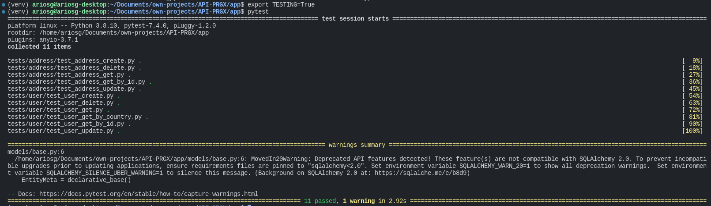
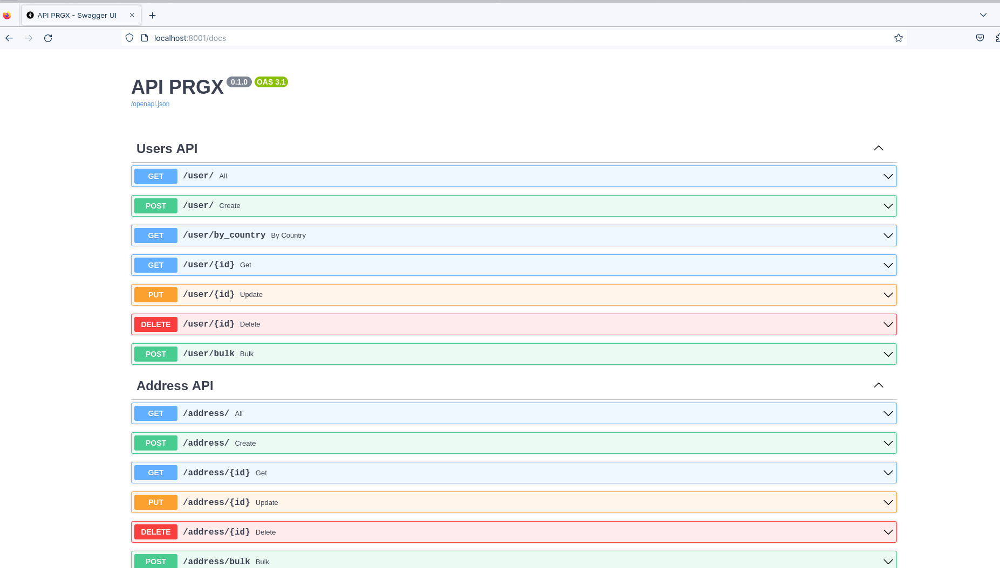
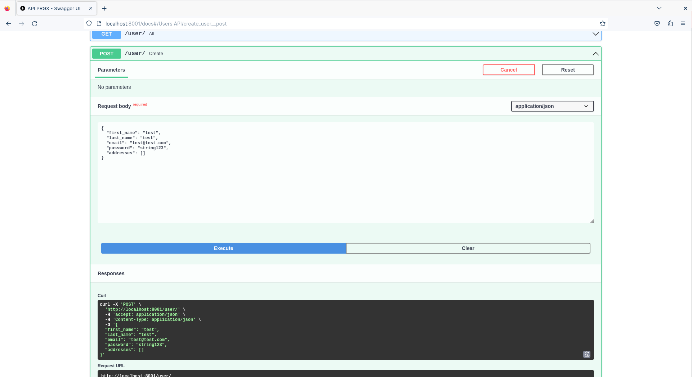
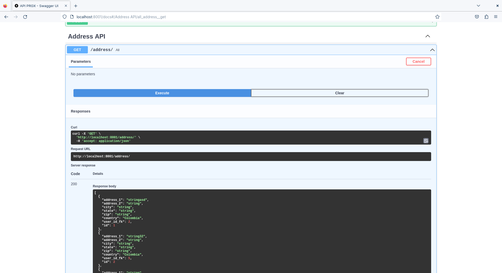
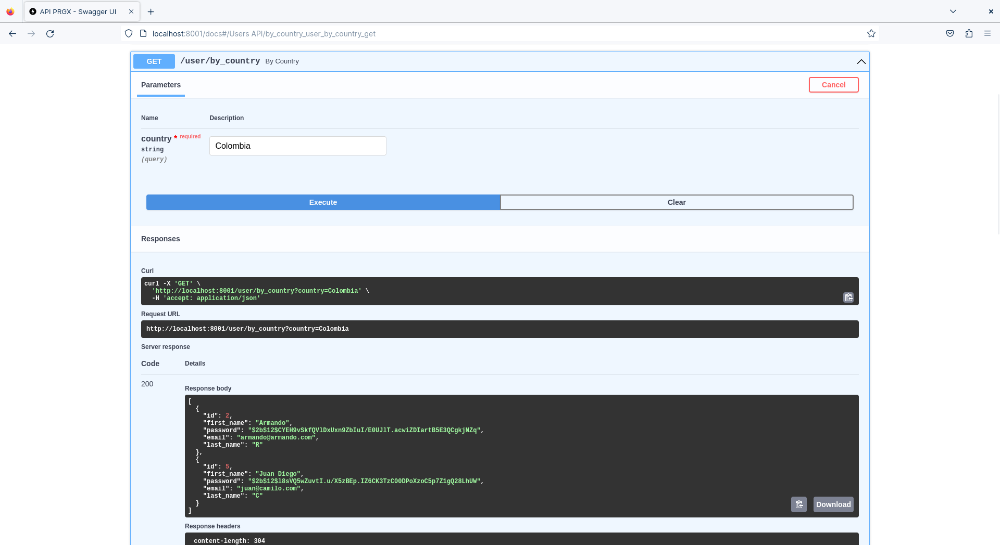

# API-PRGX
This app is using a SQLite database with data for a easy testing without any docker compose or something like that. However, you can use MySQL or MariaDB and create the database and start to use the API for populate the Database
# Run Locally without Docker
## Create a virtual environment (This step depend on your Operating System, in my case is Linux/Unix) 
```bash
python3 -m virtualenv venv
```
or
```bash
python3 -m venv venv
```
## now activate the virtual environment
```bash
. venv/bin/activate
```
Go to the folder app and install the dependencies
```bash
cd app && pip install -r requirements.txt
```
finally, run the app
```bash
uvicorn main:app --reload
```
Now, open the next route on your browser
```
http://localhost:8000/docs
```
# To run the unit testing use the next command, however please set TESTING environment variable in "True".
### Note:
Remember setting the environment variable depend on your OS
```bash
export TESTING=True
pytest
```

# Run the API using Docker
Build the docker image
```bash
docker build -t prgx-api .
```
Run the docker container
```bash
docker run --name prgx-container -p 8001:8000 prgx-api
```
# Test the App
Go to the browser and open the next url
```
http://localhost:8001/docs
```
## Here you can see all the API for user and address table

## Now, you can see how to create a user 


## and get addresses



## sample of get user by country using a join between users and addresses tables through the ORM (SQLAlchemy)



Thanks you for the opportunity
